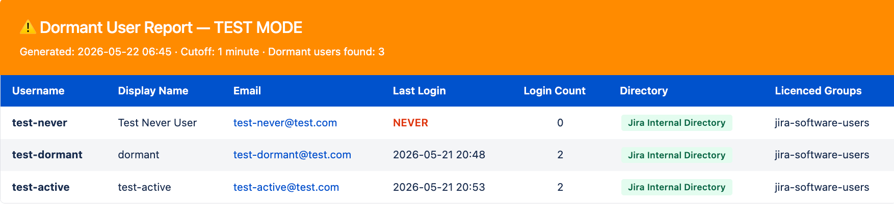

# 🔍 Dormant User Report — Jira Data Center

> ## ⚠️ PROOF OF CONCEPT
> **This is not an official Adaptavist product.**
> It comes with no warranty, no support SLA, and no guarantee it will work on your specific instance.
> **Test every updated script thoroughly before using it in production.**
> If you have questions regarding how to migrate from DC to Cloud, speak to a ScriptRunner [Customer Success Manager](https://www.scriptrunnerhq.com/locker/customer-success-team).


A ScriptRunner script that identifies inactive users on your Jira Data Center instance, helping you decide who still needs a licence and who doesn't.

---

## What it does

Scans every active, licenced user in your Jira instance and reports on anyone who hasn't logged in within a configurable number of days — including users who have **never** logged in at all.

The report renders directly inside the ScriptRunner Script Console as a formatted HTML table.



---

## What you get in the report

| Column | Description |
|---|---|
| **Username** | The user's Jira username |
| **Display Name** | Their full name |
| **Email** | Clickable mailto link |
| **Last Login** | Date and time of last login, or `NEVER` in red if they've never logged in |
| **Login Count** | How many times they have ever logged in — useful for spotting accounts that were barely used |
| **Directory** | Where the account lives — green badge for Internal (deactivate in Jira), red badge for LDAP/AD (deactivate in your company directory) |
| **Licenced Groups** | Which licenced Jira groups they belong to |

---

## Requirements

- Jira Data Center
- [ScriptRunner for Jira](https://marketplace.atlassian.com/apps/6820/scriptrunner-for-jira) installed and licenced

---

## Installation

**1. Copy the script**

Copy the contents of [`dormant-user-report.groovy`](dormant-user-report.groovy).

**2. Open the Script Console**

In Jira, go to:

```
Jira Administration → ScriptRunner → Script Console
```

Or navigate directly to:

```
https://your-jira-instance.com/plugins/servlet/scriptrunner/admin/console
```

**3. Paste the script**

Paste the script into the console editor.

**4. Configure your settings** — see [Configuration](#configuration) below.

**5. Run it**

Click **Run**. The report will appear below the editor.

---

## Configuration

There are only **three settings** you need to change. They are at the top of the script under the `YOUR SETTINGS` section.

```groovy
// ============================================================
// ✏️  YOUR SETTINGS — THIS IS THE ONLY SECTION YOU NEED TO EDIT
// ============================================================

def cutoffDays           = 90
def includeNeverLoggedIn = true
def licensedGroups       = [] as Set<String>
```

---

### `cutoffDays`
How many days without a login counts as dormant.

| Value | Meaning |
|---|---|
| `90` | Anyone who hasn't logged in for 3 months |
| `180` | Anyone who hasn't logged in for 6 months |
| `365` | Anyone who hasn't logged in for a year |

```groovy
def cutoffDays = 90
```

---

### `includeNeverLoggedIn`
Whether to include users who have never logged in at all.

| Value | Meaning |
|---|---|
| `true` | Include them — recommended, they may still hold a licence |
| `false` | Skip them — only show users who logged in at some point but have since gone quiet |

```groovy
def includeNeverLoggedIn = true
```

---

### `licensedGroups`
Which Jira groups to scan. Controls who is considered a licenced user.

| Value | Meaning |
|---|---|
| `[]` | Scan all groups in the instance — recommended starting point |
| `['jira-software-users']` | Only scan Jira Software users |
| `['jira-software-users', 'jira-servicedesk-users']` | Scan multiple specific groups |

```groovy
// Scan everyone
def licensedGroups = [] as Set<String>

// Or scan specific groups only
def licensedGroups = ['jira-software-users', 'jira-servicedesk-users'] as Set<String>
```

> ⚠️ Do not add Confluence groups here — this script is for Jira licence auditing only.

---

## Large instances

The script is safe to run on large instances (10,000+ users). It is optimised to:

- Fetch group names and directory data **once** before the loop — not once per user
- Cache directory lookups so each directory is only queried once per run
- Log progress to the Jira application log every 1,000 users

To monitor progress on a large instance, check your Jira application log during the run. You will see entries like:

```
Dormant user scan: 1000 / 25000 users processed...
Dormant user scan: 2000 / 25000 users processed...
Dormant user scan complete: 312 dormant users found from 25000 total.
```

You can find the log at:
```
Jira Administration → System → Logging and Profiling → View Log
```

---

## Understanding the Directory column

The **Directory** column tells you where a user's account is managed. This is important before taking any action.

| Badge | Colour | What it means | What to do |
|---|---|---|---|
| Jira Internal Directory | 🟢 Green | Account is managed inside Jira | Deactivate directly in Jira Admin |
| LDAP / Active Directory | 🔴 Red | Account is managed externally | Deactivate in your company's directory system |

> Attempting to deactivate an LDAP user directly in Jira will not work — it must be done at the directory level.

---

## Frequently asked questions

**Will this script make any changes to my users?**
No. This script is read-only. It only reads user and login data — it does not modify, deactivate, or delete anything.

**How long does it take to run?**
On a small instance (under 1,000 users) it typically completes in a few seconds. On a large instance (10,000–25,000 users) expect 30–90 seconds depending on your server and directory configuration.

**My instance uses LDAP — will it still work?**
Yes. The script reads from Jira's internal login tracking, which records logins regardless of which directory the user belongs to. LDAP users will appear in the report with a red directory badge.

**Can I run this on a schedule?**
Not in its current form — it is designed for the Script Console. If you need it to run automatically on a schedule, it can be adapted into a ScriptRunner Job. Raise an issue or get in touch.

**The report shows my admin account as dormant — is that right?**
If your admin account hasn't logged in within the cutoff period, yes it will appear. You can safely ignore it or exclude it by removing it from the licenced groups you are scanning.

---

## Troubleshooting

**The report shows no users**
- Check that your `licensedGroups` list matches real group names in your instance
- Try setting `licensedGroups = []` to scan all groups
- Check that `cutoffDays` isn't set too low

**The script times out**
- The Script Console has a default execution timeout
- For very large instances, consider running during off-peak hours
- Check the Jira application log to see how far the scan got before timing out

**Users I expect to see are missing**
- Check the user is active in Jira Admin — deactivated users are intentionally excluded
- Check the user belongs to at least one of the groups being scanned

---

---

## Scheduled Job (Email Report)

If you want the report to run automatically on a schedule and email the results, use [`dormant-user-report-job.groovy`](dormant-user-report-job.groovy) instead.

The job sends a fully formatted HTML email to one or more recipients and only sends if dormant users are actually found — no empty emails.

---

### Additional setting — recipients

The job script has one extra setting at the top that the console script does not:

```groovy
def recipients = [
    'admin@yourcompany.com',
    'manager@yourcompany.com',
]
```

Add as many email addresses as you need. All other settings (`cutoffDays`, `includeNeverLoggedIn`, `licensedGroups`) work exactly the same as the console script.

---

### Setting up the job in Jira

**1. Open ScriptRunner Jobs**

```
Jira Administration → ScriptRunner → Jobs → Create Job → Custom Scheduled Job
```

**2. Fill in the job details**

| Field | What to enter |
|---|---|
| **Name** | `Dormant User Report` |
| **User** | An admin user the job runs as — ideally a dedicated automation account |
| **Interval / Cron** | See cron examples below |
| **Inline Script** | Paste the contents of `dormant-user-report-job.groovy` |

**3. Click Add to save**

> ⚠️ Clicking **Run Now** will run the script immediately but will NOT save it. Always click **Add** first to save, then **Run Now** if you want to test it.

---

### Cron expression examples

| Schedule | Cron expression |
|---|---|
| Every Monday at 8am | `0 0 8 ? * MON *` |
| First day of every month at 7am | `0 0 7 1 * ? *` |
| Every day at 6am | `0 0 6 * * ? *` |
| Every Sunday at 9am | `0 0 9 ? * SUN *` |

For help building cron expressions, see [Atlassian's cron expression guide](https://confluence.atlassian.com/jirasoftwareserver/constructing-cron-expressions-for-a-filter-subscription-939938814.html).

---

### Prerequisites for email

The job sends email via Jira's mail queue. Before using it, make sure your Jira instance has an SMTP mail server configured:

```
Jira Administration → System → Outgoing Mail
```

If outgoing mail is not configured, the job will run but no email will be sent.

---


